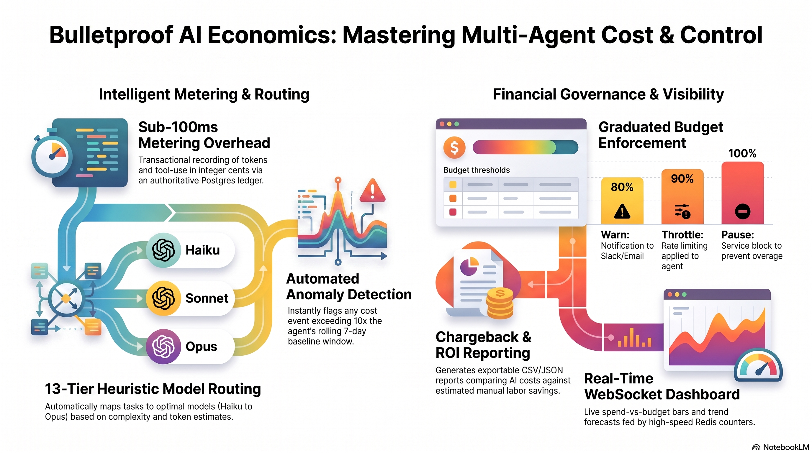

# bulletproof-agent-economics

**Cost metering, budget enforcement, model routing, and chargeback for multi-agent systems.**



`bulletproof-agent-economics` tracks what your agents cost, enforces budgets, routes
requests to the most cost-effective model tier, and produces chargeback/ROI reports.
It's a TypeScript service backed by Postgres + Redis, with a dashboard.

## What it does

- **Metering** — records per-request cost events (tokens × model pricing) into a
  cost ledger.
- **Budget enforcement** — per-project / per-agent budgets with alerting when
  thresholds approach.
- **Model routing** — routes to a model tier by capability + cost (the
  capability-router).
- **Chargeback & ROI** — daily summaries, chargeback reports, and ROI calculations.
- **Anomaly + alerts** — detects spend anomalies and dispatches alerts (email/webhook).
- **Dashboard** — a Vite/React UI over the metrics.

## Run it

```bash
npm install
cp .env.example .env          # set DATABASE_URL, REDIS_URL, ECONOMICS_JWT_SECRET
npm run migrate               # apply SQL migrations
npm start                     # API on ECONOMICS_PORT (default 8097)
```

Or via Docker (`Dockerfile` included). Postgres and Redis are required — see
`.env.example` for connection strings and `migrations/` for the schema.

## Configuration

Everything is env-driven — see [`.env.example`](.env.example):

| Var | Purpose |
|-----|---------|
| `DATABASE_URL` | Postgres connection |
| `REDIS_URL` | Redis connection |
| `ECONOMICS_PORT` / `DASHBOARD_PORT` | Service + dashboard ports |
| `ECONOMICS_JWT_SECRET` | **Required in production** — JWT signing secret |
| `EVENT_ROUTER_URL` | Optional: emit cost events to an event router |
| `QDRANT_URL` / `OLLAMA_URL` | Optional integrations |

Pairs with [bulletproof-event-router](https://github.com/bulletproofsoftware-ai/bulletproof-event-router)
and [bulletproof-metrics-engine](https://github.com/bulletproofsoftware-ai/bulletproof-metrics-engine),
but runs standalone.

## Development

```bash
npm install
npx tsc --noEmit     # typecheck
npx vitest run       # tests
```

## Documentation

- [docs/OVERVIEW.md](docs/OVERVIEW.md) — what it is and how it fits together.
- [docs/INSTALL.md](docs/INSTALL.md) — local + Docker setup.
- [docs/HOW-TO-USE.md](docs/HOW-TO-USE.md) — the REST/WebSocket API and dashboard.
- [docs/ADMINISTRATOR.md](docs/ADMINISTRATOR.md) — configuration, auth, budgets, ops.
- [docs/SBOM.md](docs/SBOM.md) — software bill of materials.
- [docs/scan/scan-report.md](docs/scan/scan-report.md) — security scan (0 critical / 0 high).

## Media

Generated overview media (NotebookLM) lives in [`media/`](media/): a slide deck,
an explainer video, and a briefing document. The overview infographic is in
[`docs/media/`](docs/media/).

## License

Apache-2.0 © 2026 bulletproofsoftware-ai. See [LICENSE](LICENSE) and [NOTICE](NOTICE).
